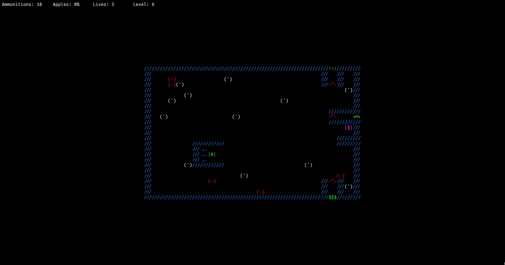

# tank T-39

## Как поиграть?

У вас должен быть установлена библиотека ncurses, и желательно запускать игру на linux или macOS

### Установка игры:

- Устанавливаем библиотеку ncurses

```
sudo apt-get update
sudo apt-get install libncurses5-dev libncursesw5-dev
```

- Загружаете репозиторий и заходите в нее:

```
git clone https://github.com/Shahvali05/tank_T-39.git
cd tank_T-39
```

- Скомпилируйте игру из исходников, для этого введите:

```
make
```

- Для запуска игры:

```
make run
```

или

```
build/tank_T-39
```

## Скриншоты

- Меню


- Игра




## Управление:

- Для передвижения используйте *стрелки* либо клавиши *a s d w*
- Для того чтобы выстрелить нажмите на *пробел* либо на клавишу *e*
- Для выхода в меню и для выхода из игры нажмите на клавишу *q*

## Можно создавать свои уровни и редактировать имеющиеся:

В общем уровней может быть 20, а имеется всего 8, и они хранятся в директории *levels*

Открываете любой файл или создаете свой, к примеру '9.txt' и можете разместить блоки как хотите.

Важно: ширина должна быть 81 символ и высота 25 символ

Один блок это 3 символа ('///')

Все блоки:

- Пустота - "   "
- Стена - "///"
- Дверь входа - "..." (по секрету это тоже стена)
- Еда - "111"
- Боеприпасы - "222"
- Танк(игрок) - "@@@" (можно иметь только одного танка)
- Красная дверь которая исчезнет если собрать всю еду - "^^^"
- Выход к следующему уровню - "***"
- Стена которую можно сломать - "==="
- Аптечка - "+++"
- Враг идущий вниз - "ddd"
- Враг идущий вверх - "uuu"
- Враг идущий вправо - ">>>"

- Враг идущий влево - "<<<"
- Выход ведущий к боссу - "!!!"
- Выход ведущий к боеприпасам - "$$$"
